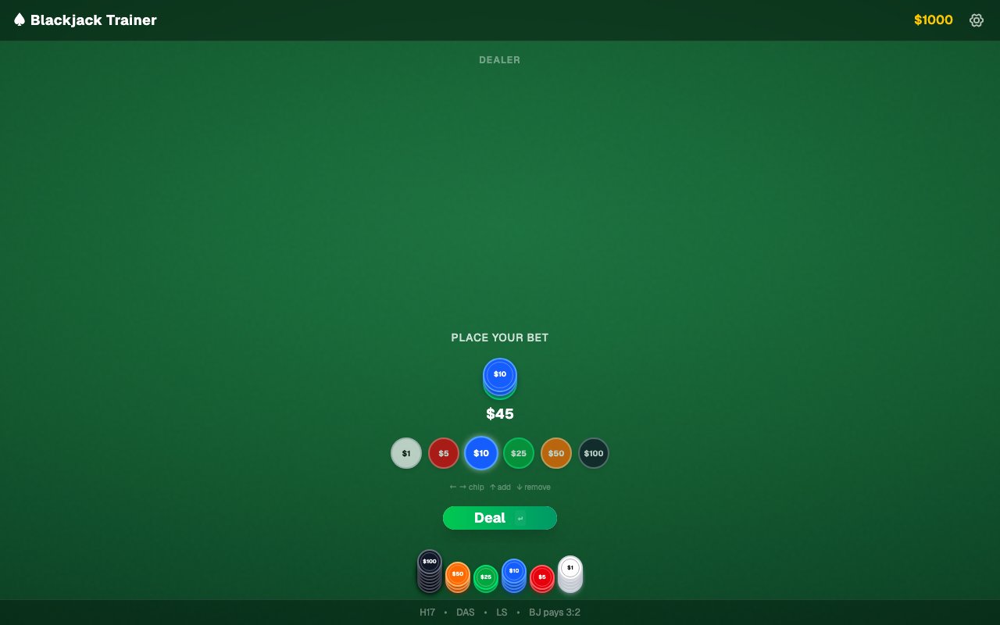
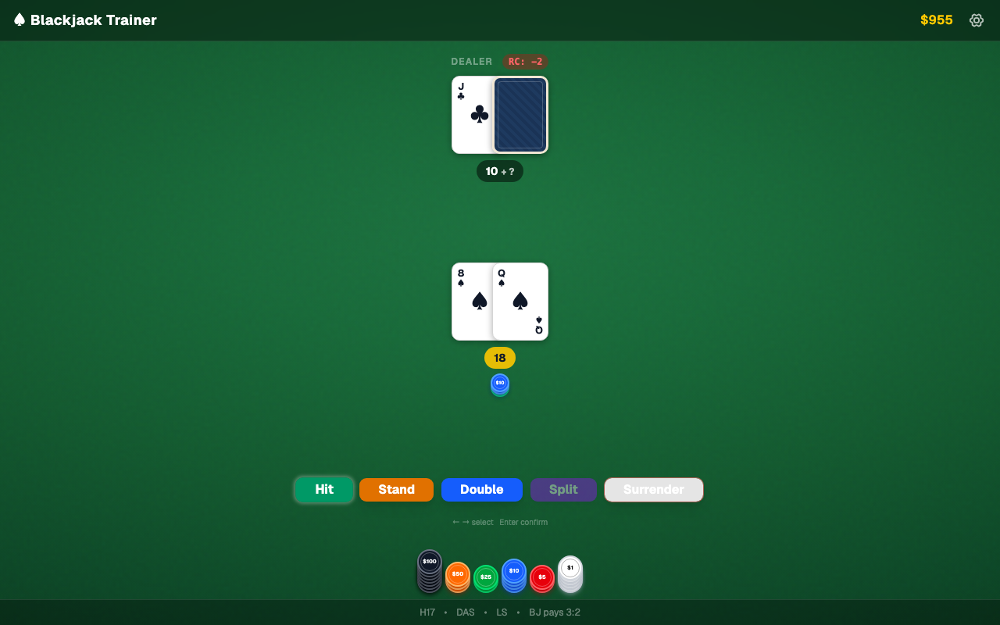
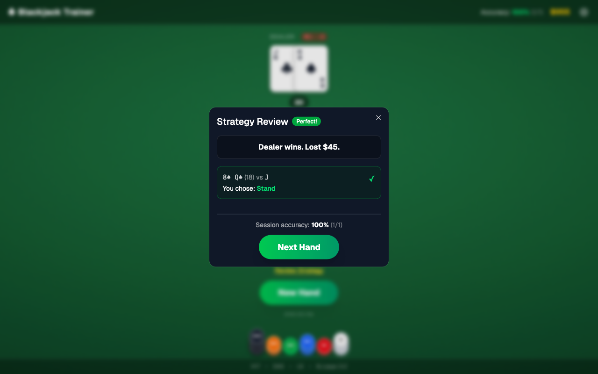
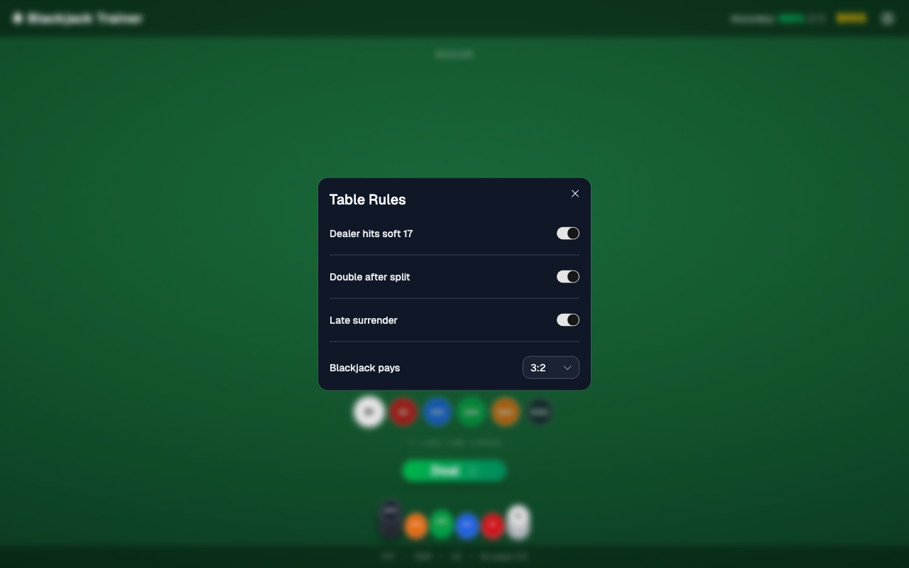

# ♠ Blackjack Trainer

Web app to practice blackjack against a dealer using a **single deck**, reshuffled after every hand. After each round you get **basic strategy** feedback (what was optimal vs what you played). No backend or database—rules and strategy live in code.

- **Live demo:** local only (run `pnpm dev` below)

---

## 🖼️ Screenshots

**Betting** — chip presets, bet pile, bank stacks.



**Playing** — dealer and player hands, Hi-Lo running count, action bar.



**Strategy review** — hand outcomes, payouts, session accuracy, next hand.



**Settings** — H17/S17, DAS, surrender, blackjack payout.



---

## ✨ Features

- **Basic strategy** — After the hand, optional review of each decision vs chart-perfect play.
- **Configurable rules** — Dealer hits/stands on soft 17, double after split, late surrender, blackjack pays 3:2 or 6:5 (gear / settings dialog).
- **Splits** — Up to four player hands (split to max four hands).
- **Hi-Lo count** — Running count (RC) updates on face-up cards; single-deck only (no true count).
- **Keyboard-first** — Betting: arrows to change chip and adjust bet, Enter to deal. Playing: arrows to highlight actions, Enter to act. `,` toggles settings.
- **Chips** — Color-coded denominations; bank grouped by value, bet as mixed stacks; balance also shown in the header.
- **Session stats** — Optional accuracy % across decisions for the session.

---

## 🛠️ Tech stack

| Category | Technology |
|----------|------------|
| **Framework** | React 19, React Router 7 (Vite) |
| **Language** | TypeScript |
| **Styling** | Tailwind CSS v4 |
| **UI** | shadcn/ui (Radix-style primitives) |
| **Icons** | Phosphor Icons |
| **Package manager** | pnpm |

---

## 📦 Setup

1. Clone the repo and open the project root.
2. Install dependencies:

   ```bash
   pnpm install
   ```

3. Start the dev server:

   ```bash
   pnpm dev
   ```

4. Open the URL printed in the terminal (often [http://localhost:5173](http://localhost:5173)).

---

## 🎮 Usage

### 🖱️ Mouse

Use on-screen chips and buttons to bet, deal, and choose Hit / Stand / Double / Split / Surrender. Open **Settings** from the gear in the header.

### ⌨️ Keyboard

- **Betting:** `←` / `→` select chip value, `↑` add to bet, `↓` remove from bet, `Enter` or `Space` deal.
- **Playing:** `←` / `→` move between actions, `Enter` / `Space` / `↓` confirm.
- **Settings:** `,` open or close (when not typing in a field).
- **Results / modals:** navigation keys dismiss where documented in the UI.

---

## 📜 Scripts

| Command | Description |
|---------|-------------|
| `pnpm dev` | Start dev server with HMR |
| `pnpm build` | Production build |
| `pnpm start` | Serve production build (`react-router-serve`) |
| `pnpm typecheck` | React Router typegen + `tsc` |
| `pnpm screenshots` | Regenerate `docs/screenshots/*.png` for the README (Playwright + Chromium) |

**First-time Playwright browsers:** if `pnpm screenshots` fails, run `pnpm exec playwright install chromium`.

---

## ☁️ Deployment

Client logic is entirely in the bundle; production output is produced by `pnpm build`. Serve with any host that can run the React Router server or static hosting pattern your template expects.

**Docker:** A [`Dockerfile`](Dockerfile) is included (Node 20 Alpine, `npm ci` + `npm run build` + `npm run start`). It expects npm lockfiles as written; if you standardize on pnpm only, update the Dockerfile to use `pnpm` accordingly.

---

## 📸 Screenshots (maintainers)

Automated captures (1280×800, full page):

```bash
pnpm screenshots
```

This runs [`e2e/readme-screenshots.spec.ts`](e2e/readme-screenshots.spec.ts) with [`playwright.config.ts`](playwright.config.ts): it starts `pnpm dev`, walks through bet → deal → stand → strategy dialog → settings, and overwrites the four PNGs under `docs/screenshots/`. With `pnpm dev` already running, the same command reuses the server (`reuseExistingServer` when `CI` is unset).

Manual capture notes: [`docs/screenshots/README.md`](docs/screenshots/README.md).
